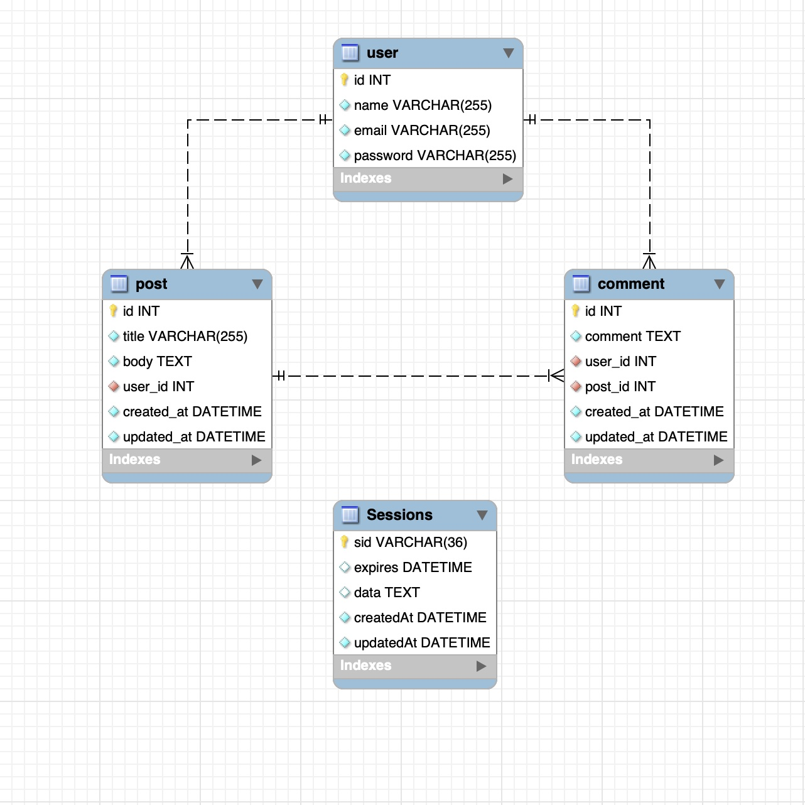

  # Model-View-Controller Tech Blog

  
  
  ## Table of Contents 
  - [Description](#description)
  - [Installation](#installation)
  - [Usage](#usage)
  - [Contributions](#contributions)
  - [Tests](#test)
  - [License](#license)
  - [Questions](#questions)
  

## Description

This project is a full-stack web application. The site serves as a tech blog, where users are able to create accounts, write blog entries and comment on their own and others' posts.

The project utilizes `Express.js`, `Sequelize` and a `MySQL` database on the back end, with an `HTML5` front end dynamically generated through `Handlebars.js`. The application is deployed through `Heroku`.

## Installation

No installation is required for the user to interact with this site. In order to post blogs or comment, the user will be required to create an account by entering in a login name and password in the sign in form. See below for more information. 

## Usage
The deployed site can be found [here](https://lerner-tech-blog.herokuapp.com/).

Here is a GIF demonstrating functionality:

To view a higher resolution version of this video, please navigate to my [Google Drive](https://drive.google.com/file/d/1AhzIrhZT78gkjifQESdpkUu5YC4q9ZNf/view).

The following image demonstrates the layout and relationships between the tables:

## Contributions

Thank you to classmates Eric Kirberger and Azime Nail, tutor Dru Sanchez, and TAs Paul Cwik and Justyn Subrai for their guidance with this project. 

## Tests

All tests were performed via `Insomnia`.

## License
This project is licensed under the MIT license.
    

## Questions
See more of my work [here!](https://github.com/sam-lerner) 

I can be reached via e-mail at sam.a.lerner@gmail.com. Thank you for reading!

